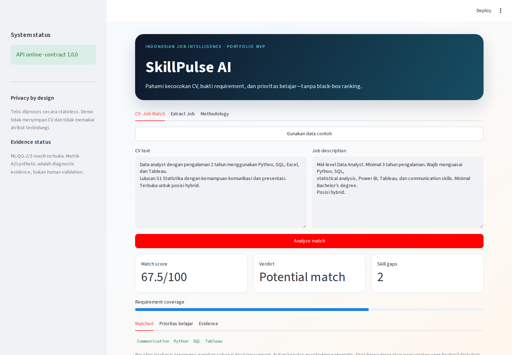
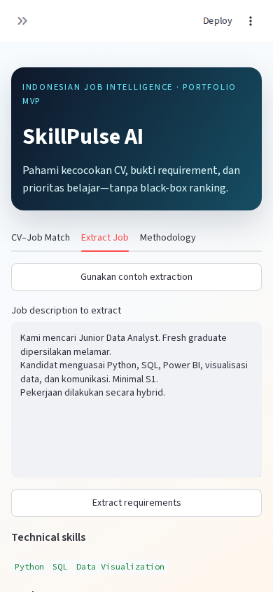

# SkillPulse AI

[](https://github.com/Rajapranata512/skillpulse-ai/actions/workflows/ci.yml)
[](https://github.com/Rajapranata512/skillpulse-ai/actions/workflows/codeql.yml)
[](pyproject.toml)
[](SECURITY.md)

SkillPulse AI is an Indonesian job-intelligence portfolio project built from research on
data and analytics job descriptions. The current milestone turns the original notebook
into a reproducible data pipeline, bilingual extraction baseline, review workflow,
explainable CV-to-job matching product, and privacy-safe 30-day market snapshot.

## What works now

- Reproducible provenance and cleaning for 555 Indonesian data-and-analytics postings.
- Bilingual explicit-entity extraction with a 100-document development evaluation.
- Explainable CV-to-job matching with evidence, gaps, weights, and learning priorities.
- A strict four-endpoint FastAPI contract, healthy non-root container, and API-backed
  Streamlit demo.
- An aggregate-only market dashboard with requirement-category, location, and normalized-role slices.
- 133 passing tests, model/data documentation, and explicit human/data release gates.

The exact-taxonomy matcher remains the incumbent after a multilingual semantic challenger
failed to improve the frozen synthetic diagnostic. Independent annotation (0/100), human
relevance (0/50), human screen-reader/real-device usability review, a narrated walkthrough, public
deployment, and salary modelling remain open. Start with the [case study](docs/case_study.md),
[architecture](docs/architecture.md), and [model card](docs/model_card.md).

## Product preview

<p align="center">
  
  
</p>

These captures use only repository synthetic examples. Chromium verifies desktop/mobile, loading,
validation, and API-offline states; Firefox and Playwright WebKit repeat the keyboard-triggered desktop
match without horizontal overflow. Exact hashes and limitations are in
[`reports/ui_browser_qa.json`](reports/ui_browser_qa.json).

## Current dataset

SkillPulse uses 555 Indonesian Data & Analytics vacancies from
[Indonesian Data & Analytics Jobs in Jobstreet](https://www.kaggle.com/datasets/raflirizkya/indonesian-data-and-analytics-jobs-in-jobstreet),
published by Rafli Rizkya Sakti Nugraha. Version 1 covers JobStreet Indonesia postings
from 25 August to 24 September 2025 and is licensed under
[CC BY 4.0](https://creativecommons.org/licenses/by/4.0/).

The local CSV is pinned by SHA-256 and matches a fresh Kaggle download exactly. It contains
555 rows; salary is disclosed in 77 rows (13.9%), so salary modelling remains blocked.
The raw CSV is intentionally ignored by Git. The public UI reads only a deterministic
aggregate of 555 listings and 542 unique descriptions; it exposes no company, job ID, raw
description, or salary value. Reproduce the private input and public aggregate with:

```powershell
powershell -ExecutionPolicy Bypass -File scripts/fetch_dataset.ps1
python -m skillpulse.data.provenance --require-local
skillpulse-prepare
skillpulse-market-snapshot
```

See `DATA_ATTRIBUTION.md`, `data/provenance/sources.yaml`, and `reports/data_card.md` for attribution, permitted
uses, transformations, limitations, and the conservative raw-publication decision.

## Run the data pipeline

```powershell
python -m skillpulse.data.pipeline
```

Without installing the package first:

```powershell
$env:PYTHONPATH = "src"
python -m skillpulse.data.pipeline
```

The command validates the input schema, normalizes text fields, parses salary values,
removes exact duplicate vacancies, and writes:

- `data/processed/jobs_clean.csv`
- `reports/data_quality.json`

Use another input or output location when needed:

```powershell
python -m skillpulse.data.pipeline --input path/to/jobs.csv --output data/processed/jobs_clean.csv
```

## Run extraction and evaluation

Extract one job description or CV text as JSON:

```powershell
$env:PYTHONPATH = "src"
python -m skillpulse.extraction.cli text "Python, SQL, Tableau, minimal S1, hybrid"
```

Enrich a CSV with extracted attributes:

```powershell
$env:PYTHONPATH = "src"
python -m skillpulse.extraction.cli csv --input "lowongan data dan analytics jobstreet.csv" --output data/processed/jobs_with_extraction.csv
```

Evaluate the reviewed gold sample:

```powershell
$env:PYTHONPATH = "src"
python -m skillpulse.extraction.cli gold --annotations data/annotations/gold_sample.csv
```

The project also exposes package scripts after installation:

- `skillpulse-prepare`
- `skillpulse-verify-source`
- `skillpulse-extract`
- `skillpulse-evaluate`
- `skillpulse-match`
- `skillpulse-relevance`

## Run CV-to-job matching

Compare text directly and inspect the score components, matched skills, missing skills,
and learning priorities:

```powershell
$env:PYTHONPATH = "src"
python -m skillpulse.matching.cli `
  --cv-text "Data analyst with 3 years experience using Python, SQL, Tableau, S1, komunikasi" `
  --job-text "Mid-level Data Analyst requiring 2 years experience, Python, SQL, Power BI, Tableau, S1, komunikasi"
```

Text files are also supported with `--cv-file` and `--job-file`. Add
`--output reports/cv_job_match.json` to save the explainable result.

The baseline scores technical skills, tools, soft skills, education, experience,
seniority, and work arrangement. Weights are re-normalized over requirements detected
in the job description, so an absent field does not silently reduce the score.

## Annotation workflow

The deterministic sample now contains **100 project-owner-confirmed rows** with complete
annotator metadata, notes, source identity checks, and audit records. Technical and tool F1
are 1.0000, soft-skill F1 is 0.9969, experience/work-arrangement exact match is 1.0000, and
seniority exact match is 0.9900.

These are AI-assisted, human-confirmed development metrics—not an independent holdout
estimate. See `reports/extraction_gold_eval.json` and
`reports/extraction_gold_validation.md` for the results and required caveats.

Create a fully blind copy for a different human annotator:

```powershell
skillpulse-extract agreement-batch --primary data/annotations/gold_sample.csv --output data/annotations/second_annotator_blind.csv
```

The second annotator must fill all `gold_*` fields without seeing primary labels, weak
labels, suggestions, or extractor output. After all 100 rows are independently reviewed,
calculate field-level Cohen's Kappa:

```powershell
skillpulse-extract agreement --primary data/annotations/gold_sample.csv --secondary data/annotations/second_annotator_blind.csv --output reports/annotation_agreement.json --minimum-documents 100
```

The raw annotation CSV, blind/editable batches, and HTML review packs contain third-party
job-description text and are ignored by Git. Only aggregate/public-safe evidence should be
published.

An external AI-authored XLSX can be normalized into a separate, taxonomy-valid challenger
without overwriting the source or claiming human agreement:

```powershell
skillpulse-ai-challenger --input-xlsx "<path-to-workbook.xlsx>"
```

The generated local CSV/XLSX is Git-ignored. Aggregate QA and AI-versus-primary comparison
live in `reports/ai_challenger_repair.json` and `reports/ai_challenger_agreement.json`.

## Matching relevance benchmark

`data/evaluation/matching_relevance_candidates.csv` contains 50 synthetic, public-safe
CV–job pairs across 10 job groups. It contains no model score or intended relevance label.
An independent human must apply `docs/matching_relevance_rubric.md`, fill the 0–4 score and
rationale, and freeze all labels before evaluation:

```powershell
skillpulse-relevance create
skillpulse-relevance evaluate
```

The evaluator reports Spearman correlation, per-job ranking agreement, category error,
latency, verdict agreement, and explanation completeness for matcher v0.1. ML-QG-3 remains
open until the same labels are also used to evaluate a semantic challenger.

For automated regression only, keep pseudo-labels separate and compare the multilingual
semantic hybrid on exactly the same public-safe pairs:

```powershell
skillpulse-relevance create-ai-labels
skillpulse-relevance evaluate-ai
pip install -e ".[semantic]"
skillpulse-relevance evaluate-semantic
```

These results do not replace human relevance labels. The current 20% multilingual MiniLM
challenger was evaluated but not promoted because it increased error and latency.

## Domain contract

Generate the frozen transport-neutral JSON Schema before API or UI work:

```powershell
skillpulse-contract --output docs/api_contract_v1.json
```

Contract v1 forbids unknown fields, caps input text at 50,000 characters, versions model and
taxonomy outputs, and records the no-raw-CV-persistence policy.

## API service

Run the versioned local service:

```powershell
pip install -e ".[api]"
skillpulse-api
```

OpenAPI is available at `http://127.0.0.1:8000/docs`. Public endpoints are `/health`,
`/v1/models`, `/v1/extract`, and `/v1/match`. The server disables access logs in the
portfolio command and never persists request text.

Build the privacy-minimized container context (raw data, annotations, reports, notebooks,
CSV, and XLSX files are excluded):

```powershell
docker build -t skillpulse-api:local .
docker run --rm -p 8000:8000 skillpulse-api:local
```

## Portfolio UI

Launch the public-safe API and Streamlit demo together from Windows PowerShell:

```powershell
powershell -ExecutionPolicy Bypass -File scripts/run_demo.ps1 -Install
```

Omit `-Install` on later runs. The demo opens at `http://127.0.0.1:8501`, includes explicit
public-safe sample buttons plus loading, empty, validation, API-error, and aggregate market
states. Location/role slices require at least ten unique descriptions. Matching calls the
versioned API instead of importing scoring logic into the presentation layer. Stop it
with `Ctrl+C`; the launcher cleans up the API process it created. See
`docs/demo_checklist.md` for the five-minute reviewer walkthrough and port options. Use
`docs/human_accessibility_media_review.md` for the separate screen-reader, real-device,
privacy-safe recording, and human-attestation gate.

The physical-device review can use `-AllowLan -NoBrowser` on a trusted Private network.
This explicitly exposes only the Streamlit UI to the LAN; FastAPI remains loopback-only.
Use synthetic samples and stop the launcher immediately after the review.

Text is session-only and file upload is intentionally disabled in v1. For manual startup,
run `skillpulse-api` and `skillpulse-ui` in separate terminals and set
`SKILLPULSE_API_URL` when the API uses another host or port.

## Portfolio evidence

- `docs/model_card.md` defines intended use, metrics, human gates, privacy, and release
  criteria.
- `docs/case_study.md` presents the recruiter-facing problem-to-product narrative.
- `docs/release_checklist.md` records publication, media, human, and deployment gates.
- `docs/human_accessibility_media_review.md` and the blank JSON template define the private-by-default
  M5c human-review workflow; automation validates completeness but cannot create the judgments.
- `docs/architecture.md` maps the runtime, evaluation, and trust boundaries.
- `reports/portfolio_release_metrics.json` is the reconciled release-evidence snapshot.
- `reports/ui_automated_qa.json` records privacy-safe Streamlit widget-journey coverage.
- `reports/ui_browser_qa.json` records Chromium/Firefox/WebKit dimensions, dashboard charts,
  loading/offline resilience, hashes, inspection, and limitations.
- `docs/market_snapshot_metrics.md` and `reports/market_snapshot_quality.json` define and reconcile
  the aggregate market metrics, filters, suppression, and non-claims.
- `reports/portfolio_report_artifact.json` is the source-backed canonical report artifact.

The shared portable-report renderer still overflows horizontally during browser
verification, so no unverified HTML report is published. The JSON artifact and chart map
in `reports/portfolio_report_notes.md` remain available for a future renderer fix.
## Security and privacy

The repository uses a deny-by-default publication guard before every push. It blocks raw
and processed row-level data, annotations, evaluation labels, workbooks, academic/private
artifacts, credentials, local paths, email addresses, phone numbers, and common secret
patterns. Three reviewed PNG media paths are the only binary exception and must match pinned
SHA-256 values without text-metadata chunks. CI audits the exact committed snapshot, runs
`pip-audit` on a clean dependency install, and executes CodeQL `security-extended`. Dependabot
version updates and vulnerability alerts are enabled for the public repository.

See [SECURITY.md](SECURITY.md) for vulnerability reporting and security boundaries, and
[PRIVACY.md](PRIVACY.md) for the verified local data flow and public-deployment requirements.
## Test

```powershell
ruff check src tests
pytest -q
```

Current local verification: 133 tests passed and Ruff is clean.

## License

Repository-authored software is released under the [MIT License](LICENSE). The source Kaggle
dataset remains licensed separately under CC BY 4.0, and third-party job-posting text may be
subject to additional rights or platform terms; see [DATA_ATTRIBUTION.md](DATA_ATTRIBUTION.md).

## Portfolio roadmap

1. Reproducible data preparation, provenance, and extraction baseline — complete.
2. AI challenger remediation and synthetic semantic comparison — complete as diagnostic evidence;
   independent human gates remain open.
3. Explainable matcher, contract v1, FastAPI, and non-root Docker smoke — complete locally.
4. Streamlit portfolio journey — Chromium responsive/loading/offline QA, Firefox and Playwright WebKit
   keyboard smoke, and reviewed static media complete; human accessibility/real-device review and narration pending.
5. Model card, architecture/release story, public deployment verification, and monitoring — next.
6. Aggregate 30-day market snapshot with safe location/role slices — complete; time-series,
   global comparison, and salary modelling remain data-gated.

## Responsible use

SkillPulse AI is designed as decision support, not an automated hiring system. CV text
must not be retained by default. Recommendations must expose their scoring components,
and predictions must not use protected personal attributes.
