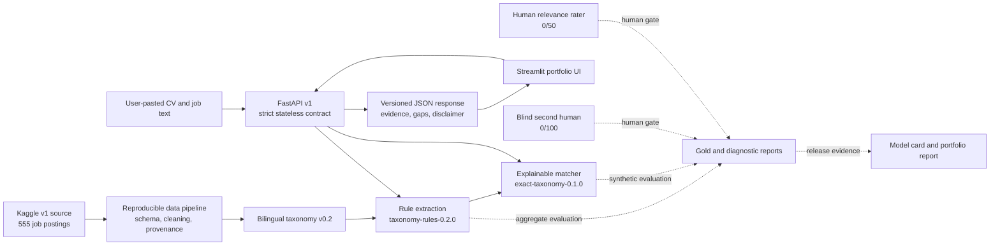

# SkillPulse AI Architecture

**Architecture version:** 1.0  
**Last verified:** 10 August 2026

## System view



The runtime path is deliberately small: the UI calls a versioned API, the API converts
transport contracts to domain calls, and scoring logic remains inside extraction and
matching modules. Evaluation and documentation consume aggregate evidence rather than
becoming runtime dependencies.

## Component responsibilities

| Layer | Repository location | Responsibility |
|---|---|---|
| Data and provenance | `src/skillpulse/data/` | Validate source identity, normalize records, and emit quality evidence |
| Taxonomy | `configs/` | Store canonical bilingual labels and aliases once |
| Extraction | `src/skillpulse/extraction/` | Extract only explicit supported requirements and run annotation workflows |
| Matching | `src/skillpulse/matching/` | Score detected job requirements against CV evidence and explain gaps |
| Domain contract | `src/skillpulse/domain/` | Enforce versioned strict request/response schemas and privacy metadata |
| API | `src/skillpulse/api/` | Expose health, model metadata, extraction, and matching endpoints |
| UI | `src/skillpulse/ui/` | Provide a public-safe bilingual demo without duplicating model logic |
| Evidence | `reports/` | Preserve aggregate evaluations, smoke tests, and release decisions |

## Runtime contract

The API exposes four endpoints:

- `GET /health`
- `GET /v1/models`
- `POST /v1/extract`
- `POST /v1/match`

Contract version 1.0.0 rejects unknown fields, caps each text input at 50,000 characters,
and returns taxonomy/model versions with outputs. OpenAPI is available at `/docs` when the
service is running.

## Trust boundaries

```text
Browser session
  -> pasted text over localhost HTTP
  -> stateless FastAPI process
  -> in-memory extraction and matching
  -> structured response
  -> browser rendering
```

Raw CV/job text is not written by the application. The portfolio container excludes raw
data, annotations, notebooks, reports, CSV, and XLSX files from its build context. Access
logging is disabled by the packaged API command. Production deployment would still need
TLS, rate limiting, abuse controls, retention verification, and operational monitoring.

## Evaluation boundaries

Three evidence classes must remain distinct:

1. **Human-confirmed development evidence:** 100 primary extraction annotations.
2. **AI/synthetic diagnostics:** external AI challenger and 50 scenario-oracle matching
   pairs; useful for regression, not human validation.
3. **Independent human evidence:** blind second annotation and relevance judgments; both
   are still pending and cannot be automated without invalidating their purpose.

The semantic challenger is isolated behind an optional dependency. Because it did not
improve the current diagnostic, the default API and UI keep the deterministic exact
matcher. Salary prediction and market-trend components remain outside the runtime until
their data and metric gates are met.

## Deployment shape

The API has a non-root Docker image with a health check. The Streamlit UI currently runs
as a local process and targets `SKILLPULSE_API_URL`. This is enough for a reproducible local
portfolio walkthrough, but a public release still needs an explicit hosting design,
environment configuration, browser QA, monitoring, and rollback evidence.
